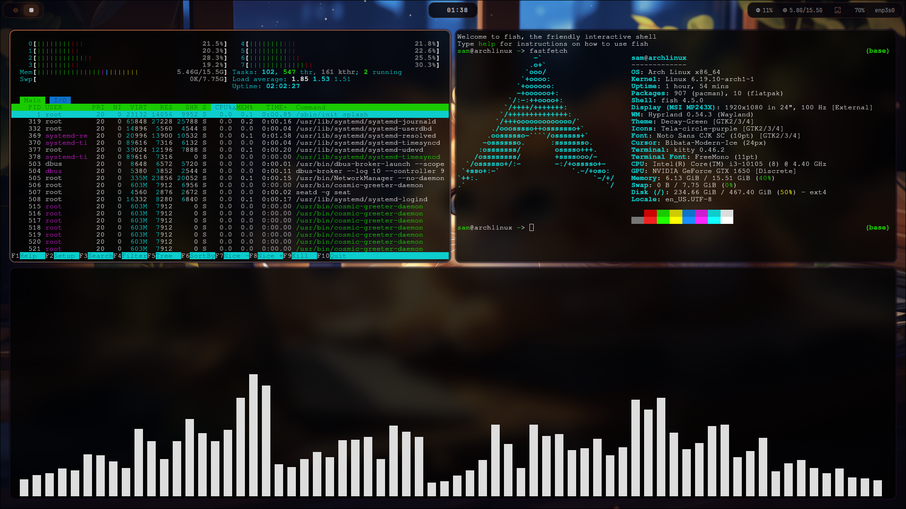

# stellar-dots 🌟



## 🖥️ System Info
| Component | Details |
|---|---|
| **OS** | Arch Linux |
| **WM** | Hyprland |
| **Shell** | Fish 4.5.0 |
| **Terminal** | Kitty 0.46.2 |
| **Theme** | GalacyGreen (GTK2/3/4) |
| **Icons** | Tela-circle-purple |
| **Cursor** | Bibata-Modern-Ice (24px) |
| **Font** | Noto Sans CJK SC |
| **CPU** | Intel Core i3-10105 @ 4.40GHz |
| **GPU** | NVIDIA GeForce GTX 1650 |
| **Memory** | 15.51 GiB |

## 📁 Contents
- `hypr/` — Hyprland, hyprlock, hypridle, shaders, workflows
- `waybar/` — Status bar
- `rofi/` — App launcher
- `kitty/` — Terminal
- `nvim/` — Neovim
- `fish/` — Fish shell config
- `gtk-3.0/` & `gtk-4.0/` — GTK theming (Catppuccin Mocha)

## ⚙️ Installation
```bash
git clone https://github.com/magnetarstar/stellar-dots.git
cd stellar-dots
cp -r * ~/.config/
```

## 📝 Credits
Made with ❤️ by magnetarstar
